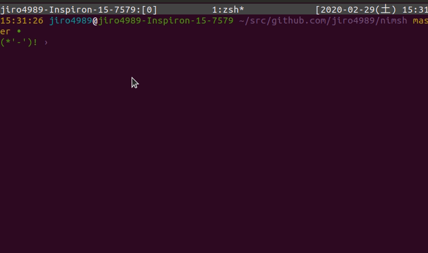

=====
nimsh
=====

nimsh is a simple implementation of a shell in pure Nim.
nimsh is inspired by `lsh <https://github.com/brenns10/lsh>`_.

|image-demo|

.. contents:: Table of contents
   :depth: 3

Usage
=====

.. code-block:: shell
   nimble build
   ./nimsh

